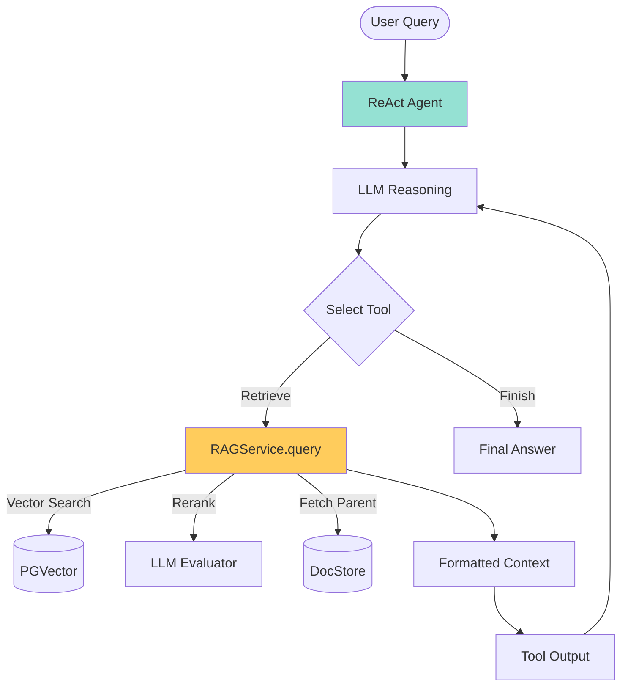

# Developer Guide

This guide provides a detailed overview of the RAG system's architecture, components, and development practices.

---

## 📊 System Architecture

The system is now a single, modular LangGraph ReAct agent that runs primarily from notebooks or the API service.

### Retrieval Architecture: Two-Stage Optimization

The core retrieval logic (`rag_system/rag_service.py`) implements a **Two-Stage Retrieval** strategy to optimize token usage and accuracy:

1.  **Stage 1: Broad Search (Summary)**
    -   Retrieves top `summary_top_k` (default: 10) **child chunks** (summaries) from the Vector Database.
    -   Goal: Maximize recall to ensure the correct document is in the candidate list.

2.  **Stage 2: LLM Reranking**
    -   Uses a fast LLM call to analyze the 10 candidates.
    -   Selects the **single most relevant** candidate based on the user query.
    -   Goal: Filter out noise (e.g., similar but incorrect laws) and identify the true source.

3.  **Stage 3: Full Context Fetch**
    -   Retrieves the **Parent Document** (full context) corresponding to the selected candidate from the Local File Store.
    -   Returns only this high-quality context to the Agent.

### Overall Agent Flow



---

## 📂 Project Structure

```
rag_system/
├── workflow.py              # Notebook/API helper for building workflows
├── agent.py                 # LangGraph workflow builder
├── node.py                  # ReAct agent node
├── state.py                 # GraphState definition
├── rag_service.py           # Core Two-Stage Retrieval & Indexing Logic
├── cli.py                   # CLI entry points (query, retrieve, serve)
├── config.py                # Configuration (RAGConfig)
├── tool/                    # LangChain tools
└── notebooks/
    ├── 1_build_index.ipynb       # QuickStart: Indexing & Retrieval Demo
    └── Launch_API_Server.ipynb   # API Server Launcher
```

### Key Scripts

-   **`scripts/reindex.py`**: The main utility for rebuilding the index. Clears DB/Docstore and re-indexes `data/converted_md`.
-   **`scripts/debug/`**: Contains debugging tools (`check_db_status.py`, `clear_data.py`).

---

## 🔧 Building the Index

You have two ways to manage the index:

1.  **Python Script (Recommended for CI/CD)**:
    ```bash
    # Rebuilds index from scratch (clears DB)
    python scripts/reindex.py
    ```

2.  **Notebook (Recommended for Learning)**:
    -   Open `notebooks/1_build_index.ipynb`
    -   Follow the step-by-step guide to index files and test retrieval.

---

## 🔍 Testing Retrieval

To debug the retrieval logic *without* running the full Agent, use the CLI:

```bash
# Test the Two-Stage Retrieval directly
python -m rag_system.cli retrieve "軍人權益事件處理法第15條規定了什麼？"
```

This will show you exactly which candidates were found, which one the LLM selected, and the final document content.

---

## 📦 Database Setup (PostgreSQL + PGVector)

The recommended setup uses Docker Compose.

### 1. Start the Database

```bash
docker compose up -d
```

### 2. Verify

```bash
python scripts/debug/check_db_status.py
```

---

## 🔌 Subgraph Integration

The RAG system is designed to be a self-contained subgraph that can be integrated into a larger multi-agent system.

### Core Concept

The `create_rag_subgraph` function in `rag_system/subgraph.py` returns a compiled LangGraph object. The parent graph delegates tasks to this subgraph, which handles all internal logic and returns the final answer.

### Integration Steps

1.  **Import**: Import `create_rag_subgraph` and `RAGConfig`.
    ```python
    from rag_system.subgraph import create_rag_subgraph
    from rag_system.config import RAGConfig
    ```

2.  **Initialize**: Create the RAG configuration and the subgraph node.
    ```python
    llm = ChatOpenAI(model="your-model")
    rag_config = RAGConfig.from_env()
    rag_node = create_rag_subgraph(llm, rag_config, name="rag_expert")
    ```

3.  **Add to Graph**: Add the `rag_node` to your supervisor graph.
    ```python
    supervisor_graph.add_node("rag_expert", rag_node)
    ```

---
**Last Updated**: 2025-12-04
